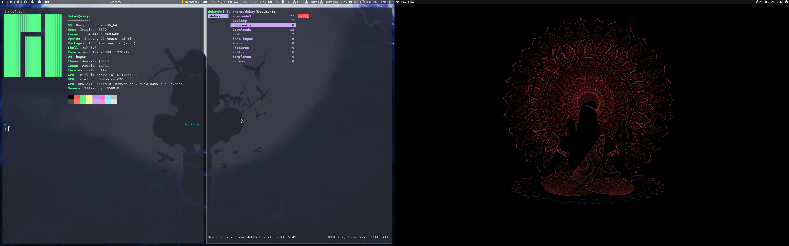

# BSPWM configs on Manjaro

## dependancies 
pacman dependecies : `$ sh ./dependencies/pacman_dependencies.sh`
AUR depedencies    : `$ sh ./dependencies/AUR_dependencies.sh`

## BSPWM
Copy the `./dotfiles/.config/bspwm/bspwm` as `$HOME/.config/bspwm/bspwm`.

## SXKHD
Copy the `./dotfiles/.config/sxkhd/sxkhd` as `$HOME/.config/sxkhd/sxkhd`.

## Multi-Monitor
Open `arandr` and set the screen layout accordingly. Save the layout in `~/init_bspwm/display.sh`.

## Wallpaper
Using feh : 
	- Make a directory - `mkdir -p $HOME/init_bspwm/wallpaper`. Copy the wallpapers in that directory. 
	- copy the `.dotfiles/.fehbg` in home directory.

## Polybar
copy the `./dotfiles/.config/polybar/*` in `$HOME/.config/polybar/*`.
For multi monitor modify the `launch.sh` script.

### bluetooth
Install blueberry package to manage bluetooth settings. (For CLI - **blutoothctl**)
Copy `./init_bspwm/bluetooth/*` as `$HOME/init_bspwm/bluetooth/*`.

### weather
Copy files `./init_bspwm/openapiweather/*` in `$HOME/init_bspwm/openapiweather`.
Edit the details like api-key and city code.

### github
Generate notification token for GitHub.
Make a file : `$HOME/init_bspwm/github_api.token`. Copy the api in that file which will be accessed by polybar to show the notifications.

## lsDelux
For installation of lsdelux install the prerequisites and follow the instruction given [here](https://github.com/Peltoche/lsd).
Set the alias for lsd to ls commands.

## Gedit
Install the gedit and for drakula theme follow [the instructions](https://draculatheme.com/gedit).

## Thunar
Install the thunar. To set the dark theme, install lxappearance and set the theme accordingly.
Check also `./dotfiles/.config/Thunar/uca.xml` for changing the default terminal.

## zsh
0. Install the powerlevel10k theme.
1. copy the `.dotfiles/.p10k.zsh` as `$HOME/.p10k.zsh`
2. copy the `./init_bspwm/zsh/aliasrc` as `HOME/init_bspwm/zsh/aliasrc` 
3. copy the `.dotfiles/.zshrc` as `$HOME/.zshrc`

## alacritty
Copy the `./dotfiles/.config/allacritty/alacritty.yml` as `$HOME/.config/allacritty/alacritty.yml`.

## mousepad
To install drakula theme follow the [instructions.](https://draculatheme.com/mousepad)

## vim
For installing the drakula theme follow the instruction [here](https://draculatheme.com/vim).
Add the `$HOME/.vim/vimrc` to change the configs. see `./init_bspwm/.vim/vimrc`.

## Thunderbird
- see [here](https://github.com/darshan315/bspwm_config/tree/main/thunderbird/ReadMe.md).

## Firefox
- see [here](https://github.com/darshan315/bspwm_config/tree/main/firefox/ReadMe.md).

## Chrome
- see [here](https://github.com/darshan315/bspwm_config/tree/main/chrome/ReadMe.md).

## sources
[1](https://github.com/polybar/polybar),  [2](https://draculatheme.com/),  [3](https://github.com/ryanoasis/nerd-fonts),  [4](https://github.com/BrodieRobertson),  [5](https://gitlab.com/eflinux),  [6](https://gitlab.com/dwt1),  [7](https://github.com/Axarva/dotfiles-2.0),  [8](https://github.com/msaitz/polybar-bluetooth)
